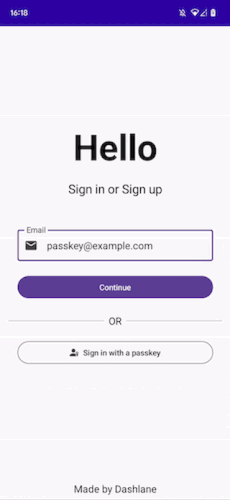

# Android Passkey Example

The purpose of this demo application is to showcase the implementation of passkeys in a native Android application. It also serves
as an example for developers who want to incorporate passkey authentication in their own app. This code application requires
Android 14 or higher.

## What is a passkey?

Passkeys are a replacement for passwords. A password is something that can be remembered and typed, and a passkey is a secret stored on one’s devices, unlocked with biometrics.

You can learn more about passkeys here: https://passkeys.dev/docs/intro/what-are-passkeys/

## Features

You can create a passkey and sign in to this demo application. It's possible thanks to
the [Credential Manager API](https://developer.android.com/jetpack/androidx/releases/credentials) which brings passkey
support to Android 14. The WebAuthn spec this is based on can be found here: [WebAuthn](https://w3c.github.io/webauthn/).

All accounts are stored locally (in shared preferences), which means that if you uninstall or clear data, your account will be lost. This app does not require any network resource.

During the sign in flow, a challenge, which is just some random bytes, is generated by the website/service (commonly referred to as the relying party). This challenge is sent to the authenticator via the app, where it is signed with the private key of the passkey. The signed challenge is then returned to the relying party to be verified. In this expample app the challenge is verified locally within the app - note that this is usually done by a server.

You can sign in to a specific account by entering an email that already exists in the local database. By doing that, the `allowCredentials`
attribute of a passkey request will be set with a related UserID, and only this credential can be returned by the authenticator.

## How to Test the Application

You can clone and build this application to generate a debug APK, or you can directly download the APK from the GitHub "Release" section.

## Contributing

We are open to contributions. Feel free to submit a pull request with your changes. Here are some features that could be added to this
application:

- Add other supported algorithms from [this list](https://www.iana.org/assignments/cose/cose.xhtml#algorithms)
- Remove a specific local account without the need to uninstall or remove all data
- Upgrade the Credential Manager library to the latest version

## License

This project is licensed under the Apache 2.0 License.
